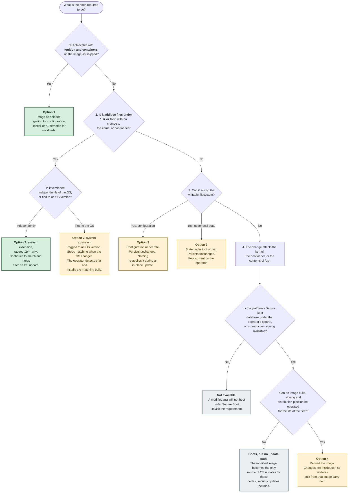

# Customizing Azure Container Linux: options and update behavior

This document describes how ACL is built, what an OS update replaces, and which customization options
are available today.

---

## 1. Image structure

ACL ships as an immutable OS image with a fixed partition layout:

| Area                 | Size                      | Mount              | Role                                                                |
| -------------------- | ------------------------- | ------------------ | ------------------------------------------------------------------- |
| EFI System Partition | 256 MiB                   | `/boot`            | Signed boot artifacts                                               |
| OS slot A            | 1 GiB                     | `/usr` when active | One complete copy of the OS. Read-only and integrity-protected      |
| OS slot B            | 1 GiB                     | `/usr` when active | The other copy. An update writes here, then activates it            |
| OEM                  | 128 MiB                   | `/oem`             | Platform integration content                                        |
| ROOT                 | Grows to fill the OS disk | `/`                | Writable. Contains `/opt`, `/var`, and the writable layer of `/etc` |

Each OS slot also has a small companion partition holding the integrity hash tree for its `/usr`. Only
the active slot is populated when the image is built.

The following properties apply to every ACL node:

- **`/usr` is read-only and integrity-protected.** Every block is verified at runtime against a hash
  tree, whose root hash is recorded in a signed boot artifact. Any change to `/usr` changes that hash.
- **There is no package manager and no RPM database.** OS packages cannot be installed, removed, or
  patched in place on a running node.
- **`/etc` is an overlay filesystem.** Its lower layer comes from the active `/usr` slot; its writable
  upper layer is on ROOT.

### Slot selection at boot

The kernel is packaged as a signed Unified Kernel Image whose built-in command line is the same for both
slots. Which slot to boot is supplied separately, by a small signed artifact stored alongside it on the
EFI System Partition, and switching slots means replacing that artifact rather than rebuilding the image.

This has two consequences for customization:

- **Switching slots does not require re-signing.** One signed kernel image boots either slot.
- **Changing the contents of `/usr` does require re-signing**, because it changes the integrity hash the
  boot path verifies.

## 2. Update behavior

ACL updates are A/B updates, performed on the node by Trident, which is installed and enabled in the
image. The update writes the complete new OS into the **inactive** slot, updates the boot artifacts on
the EFI System Partition, and reboots into the new slot. The previous slot is retained, which is what
makes rollback possible.

An A/B update **replaces the entire OS**: kernel, system libraries, and every OS-supplied binary. It
does so as a single atomic operation, and it is the mechanism by which an ACL node receives OS security
updates, since OS packages cannot be patched in place.

**An A/B update replaces exactly two things:**

- the inactive OS slot, and
- the signed boot artifacts on the EFI System Partition.

**Everything else is shared between slots and is carried across the update unchanged:**

- `/` (ROOT), including `/opt`
- `/var`
- the writable layer of `/etc`
- `/oem`

This is by design: it is how node state, logs, and configuration survive an OS update.

### Scope of an update

Customizations are generally orthogonal to A/B updates. An update generally runs
and completes regardless of what has been added to the node.

What varies is **coverage**. An A/B update covers the OS and only the OS. **Content placed outside `/usr`
is not replaced by an update, and is not re-created or re-validated by one.** It remains exactly
as it was, now running alongside a new OS version.

This establishes a division of responsibility:

|                                    | Who updates it              | On what schedule                                             |
| ---------------------------------- | --------------------------- | ------------------------------------------------------------ |
| The OS (`/usr` and boot artifacts) | Delivered by the A/B update | Each OS release                                              |
| Anything added outside `/usr`      | The operator                | At the operator's discretion, and the operator must detect when the OS changes beneath it |

Content that is independent of the OS version can often be left alone. Content that is tied to a specific
OS or kernel version requires an operator-supplied mechanism to detect the change and install a matching
build.
Section 4 states, for each option, which of the two categories it falls into.

## 3. Selecting an approach

Green outcomes stay current across OS updates without further action. Amber outcomes require the operator
to maintain the content against each OS release. Grey outcomes are not viable as stated.

The two questions under option 4 are independent. Signing authority determines whether a modified image
will boot at all; the ability to operate a pipeline determines whether those nodes keep receiving OS
updates afterwards. Meeting the first without the second produces nodes that boot correctly and then
stop receiving OS security updates.

In text form:

1. **Can the requirement be met by a container or first-boot configuration?** Option 1. The image stays
   as shipped and nothing further is required.
2. **Is it additive files under `/usr` or `/opt`, with no change to the kernel or bootloader?** Option 2.
   Tag the extension `ID=_any` if it is versioned independently of the OS, or to a specific OS version if
   it must be replaced whenever the OS changes.
3. **Is it node-local state or configuration that is re-created whenever the node is reprovisioned?**
   Option 3, noting that nothing re-applies it during an in-place update.
4. **Does it require changing the kernel, the bootloader, or the contents of `/usr`?** Option 4 is the
   only option that supports this, subject to the three requirements listed in section 4.

Platform note: some platforms that provision ACL nodes on the operator's behalf expose a fixed
configuration interface. Where that is the case, the available options are determined by that interface,
independently of what the image supports. Consult the relevant platform's node configuration
documentation.

## 4. Options in detail

Each entry states what it can change, what an A/B update does to it, and what it requires.

### Option 1: Use the image as shipped

Use the configuration and workload interfaces the image already provides.

- **Runtime configuration:** Ignition, supplied as instance user data and applied on first boot.
- **Workloads:** containers, run under Docker or Kubernetes.

**Scope of change:** anything expressible as first-boot configuration or as a containerized workload.

**Update behavior:** container workloads are unaffected by an OS update, because they are pulled by
digest and reconciled by the orchestrator. Ignition runs on first boot only; it is applied again when a
node is reprovisioned or reimaged, but not during an in-place A/B update. Files Ignition writes to
`/etc` persist across an update unchanged.

**Requirements:** none beyond the standard image.

### Option 2: System extensions (sysext)

A system extension is a self-contained image (an erofs, squashfs, or ext4 filesystem, or a directory)
that `systemd-sysext` overlays onto the running system at boot. The sealed `/usr` is not modified, so no
re-signing is required.

**Scope of change:** files under **`/usr` and `/opt` only**. Content in an extension outside those
two hierarchies, including anything under `/etc` or `/var`, is not merged and has no effect.

**Where extensions are read from:** `/etc/extensions/`, `/run/extensions/`, and `/var/lib/extensions/`.
When running in the initrd, `/.extra/sysext/` is also read, populated from the EFI System Partition.
`/var/lib/extensions/` is the primary location for installed extensions; `/etc/extensions/` is
appropriate for symlinks to images stored elsewhere.

**Version matching.** Each extension carries an `extension-release.<NAME>` file, whose name must match
the image filename. Matching rules, enforced at merge time:

| Field           | Rule                                                                               |
| --------------- | ---------------------------------------------------------------------------------- |
| `ID=`           | Must match the host's `ID`, unless set to `_any`                                   |
| `SYSEXT_LEVEL=` | If `ID` is not `_any` and this field is defined, it must match the host            |
| `VERSION_ID=`   | Used instead of `SYSEXT_LEVEL` when the latter is not defined; must match the host |
| `ARCHITECTURE=` | Must match the running kernel's architecture, unless set to `_any`                 |

An extension whose fields do not match the running OS is not merged.

**Update behavior:** all extension search directories are on ROOT, which an A/B update does not replace.
Extension files therefore remain on the node after an update, and are re-merged on the next boot
**if they still match the new OS version** under the rules above.

This produces two distinct outcomes, determined by how the extension is tagged:

- An extension tagged `ID=_any`, versioned independently of the OS, continues to match and continues to
  be merged.
- An extension tagged to a specific OS `VERSION_ID` stops matching once the OS version changes, and is
  no longer merged. The files remain on disk. Replacing it with a matching build is the extension
  owner's responsibility.

**Additional constraints:**

- There is no dependency resolution. An extension must carry every file it needs that is not already in
  the base image.
- An extension must not ship `/usr/lib/os-release`, as this would override the host's OS version data.
- Kernel modules are resolved from `/usr/lib/modules/$(uname -r)`. A module built for one kernel version
  is not found by a different one.
- While extensions are merged, `/usr` and `/opt` are read-only.
- For shipping system services specifically, systemd documentation recommends Portable Services over
  system extensions, as extensions provide no isolation from the host.

**Note on configuration extensions (confext).** `systemd-confext` applies the same extension model to
`/etc`. On the systemd version ACL currently ships (255), merging an extension makes the underlying
hierarchy read-only for the duration of the merge. Because ACL requires a writable `/etc`, confext is not
usable on ACL today.

### Option 3: Write to the writable filesystem

Write files directly to ROOT, typically under `/opt` or `/etc`, using a provisioning script or another
first-boot mechanism.

**Scope of change:** anything on the writable filesystem.

**Update behavior:** content persists across an A/B update unchanged. It is not replaced, updated, or
validated against the new OS version. If the mechanism that placed the content runs only at build time
or first boot, it does not run again during an in-place update.

### Option 4: Rebuild the image

Produce a modified ACL image using Azure Linux Image Customizer, changing content inside `/usr`.

**Scope of change:** anything in the image, including the kernel, the bootloader, and content under
`/usr`.

**Update behavior:** the changes are inside `/usr`, so they form part of what an A/B update replaces. An
update built from the modified image carries them forward. An update built from an unmodified ACL image
does not: the node boots a slot that does not contain them.

**Requirements, all mandatory:**

1. **Signing authority for the platform.** Changing `/usr` changes its dm-verity root hash. That hash is
   carried in a signed boot artifact, so the artifact must be rebuilt and re-signed with a key that the
   platform's Secure Boot database trusts. Where Secure Boot key enrollment is not under the operator's
   control, this requires production signing. On hardware where the Secure Boot database is under the
   operator's control, a self-generated key may be enrolled instead. This applies to changing the
   *contents* of `/usr`; switching between slots does not require re-signing.
2. **A base image containing an RPM database.** Image Customizer's UKI path queries the image's package
   database. The standard ACL image does not ship one, so it cannot be used as a base directly.
3. **Image distribution.** A modified image is the operator's artifact. Building, signing, storing,
   replicating and delivering it to the fleet, including for subsequent OS updates, becomes the
   operator's responsibility.

## 5. Summary

|                            | Modifies the image | What it can change                         | After an OS update                                                                      | Who keeps it current                           |
| -------------------------- | ------------------ | ------------------------------------------ | --------------------------------------------------------------------------------------- | ---------------------------------------------- |
| **1. Image as shipped**    | No                 | First-boot config; containerized workloads | Containers are reconciled by the orchestrator. Ignition-written files persist unchanged | The orchestrator, for workloads |
| **2. System extension**    | No                 | Files under `/usr` and `/opt`              | Files persist; re-merged only if still version-matched | The operator, if the extension is tied to an OS version |
| **3. Writable filesystem** | No                 | Anything on ROOT                           | Persists unchanged | The operator |
| **4. Rebuilt image**       | Yes                | Anything, including the kernel             | Replaced, by updates built from the modified image | The operator, as image publisher |

## 6. Reference

- `systemd-sysext(8)` for extension image formats, search paths, and version matching rules.
- `systemd-stub(7)` for extension images carried on the EFI System Partition.
- Azure Linux Image Customizer documentation for image rebuild configuration.
