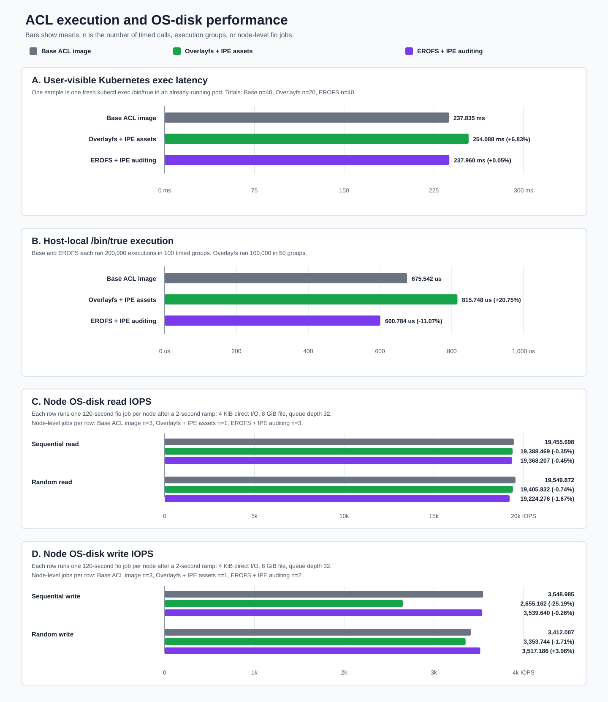
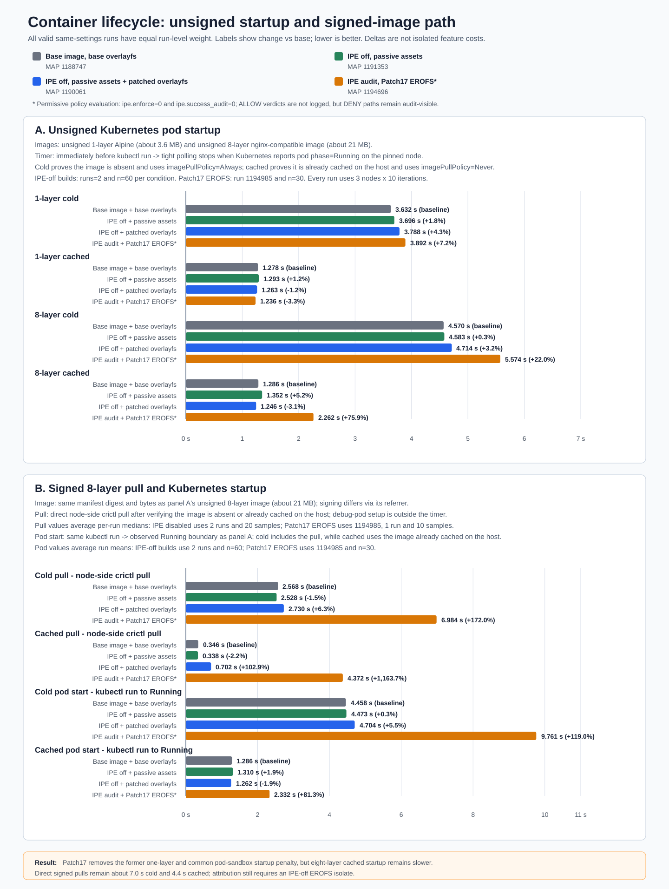

# ACL Container Runtime Performance

## Perf Results

| Question | Result |
|---|---|
| Did adding passive IPE files while keeping IPE off degrade performance? | **No broad difference is visible.** Base, passive-assets, and patched-overlayfs builds remain closely grouped across startup, Kubernetes exec, and OS-disk reads. However, base and passive-assets are different complete image generations, so this is not a one-variable asset isolate. |
| Does the patched runtime regress performance while it still uses overlayfs? | **Not broadly.** Pod-start and exec results remain aligned. Its signed-image cached pull is about **0.36 seconds slower** than base. |
| Does the active IPE + patched EROFS profile degrade performance? | **Yes, specifically in container pull and startup.** The active build is slower for both unsigned and signed images, including starts with the image cached on the host. |
| Is that slowdown isolated to IPE auditing? | **No.** This image changes IPE policy evaluation, EROFS, dm-verity, signature handling, and runtime patches together. There is no current official-containerd + active-IPE isolate. |
| Did broad exec or read/write performance regress? | **No broad exec or read regression is demonstrated.** Kubernetes exec and OS-disk reads are closely grouped. The old harness discarded the active host-local scalar after observing expected audit-mode DENYs, and the unreplicated write results are too variable for feature attribution. |

## Configurations

| Display label | What it means |
|---|---|
| **Base image, base overlayfs** | Baseline ACL image and overlayfs runtime |
| **IPE off, passive assets** | Base containerd with overlayfs, passive IPE files are present but no policy is loaded |
| **IPE off, passive assets + patched overlayfs** | EROFS-capable patched containerd and passive IPE files are present, but overlayfs is selected and no IPE policy is loaded |
| **IPE audit, patched EROFS** | IPE is enabled in audit mode, the patched containerd configured with EROFS/dm-verity is present |

Every percentage below is relative to **Base image, base overlayfs** for the same metric. 

## 1. General performance

| Configuration | `kubectl exec` mean | Host-local `/bin/true` mean |
|---|---:|---:|
| Base image, base overlayfs | 241.7 ms (**baseline**) | 731.1 us/exec (**baseline**) |
| IPE off, passive assets | 254.1 ms (**+5.1%**) | 733.0 us/exec (**+0.3%**) |
| IPE off, passive assets + patched overlayfs | 246.9 ms (**+2.1%**) | 737.0 us/exec (**+0.8%**) |
| IPE audit, patched EROFS | 233.1 ms (**-3.6%**) | **Test failed; no value published or plotted** |

| Configuration | Sequential read | Random read | Sequential write | Random write |
|---|---:|---:|---:|---:|
| Base image, base overlayfs | 19,166.7 IOPS (**baseline**) | 19,251.5 IOPS (**baseline**) | 3,433.9 IOPS (**baseline**) | 2,812.8 IOPS (**baseline**) |
| IPE off, passive assets | 19,388.5 IOPS (**+1.2%**) | 19,405.8 IOPS (**+0.8%**) | 2,655.2 IOPS (**-22.7%**) | 3,353.7 IOPS (**+19.2%**) |
| IPE off, passive assets + patched overlayfs | 19,336.8 IOPS (**+0.9%**) | 19,271.1 IOPS (**+0.1%**) | 3,064.9 IOPS (**-10.7%**) | 2,189.4 IOPS (**-22.2%**) |
| IPE audit, patched EROFS | 19,559.8 IOPS (**+2.1%**) | 19,562.2 IOPS (**+1.6%**) | 1,651.1 IOPS (**-51.9%**) | 2,306.6 IOPS (**-18.0%**) |

## 2. Container lifecycle

The figure has two explicitly different panels:

| Measurement | Image and layer shape | Operation and timing boundary |
|---|---|---|
| **Unsigned Kubernetes startup** | Unsigned Alpine, 1 layer, about 3.6 MB; unsigned nginx-compatible image, 8 layers, about 21 MB | The timer starts immediately before `kubectl run`, not `kubectl apply`, and ends when tight polling observes Kubernetes pod phase `Running` on the pinned node. Cold proves the image absent and uses `imagePullPolicy=Always`; cached proves it is already cached on the host and uses `imagePullPolicy=Never`. |
| **Signed image pull** | One immutable signed nginx-compatible image, exactly 8 layers, about 21 MB | Direct node-side `crictl pull`, timed inside the node command after verifying that the image is absent or already cached on the host. Debug-pod setup is outside the timer. |
| **Signed Kubernetes startup** | The same signed 8-layer image | The same `kubectl run` to observed `Running` boundary as the unsigned panel. Cold includes pull and layer setup; cached uses the image already cached on the host with `imagePullPolicy=Never`. |

### Unsigned Kubernetes startup

Each run measures three nodes with ten iterations, so every displayed condition has
`runs=2, n=60`.

| Configuration | 1-layer cold | 1-layer cached | 8-layer cold | 8-layer cached |
|---|---:|---:|---:|---:|
| Base image, base overlayfs | 3.632 s (**baseline**) | 1.278 s (**baseline**) | 4.570 s (**baseline**) | 1.286 s (**baseline**) |
| IPE off, passive assets | 3.696 s (**+1.8%**) | 1.293 s (**+1.2%**) | 4.583 s (**+0.3%**) | 1.352 s (**+5.2%**) |
| IPE off, passive assets + patched overlayfs | 3.788 s (**+4.3%**) | 1.263 s (**-1.2%**) | 4.714 s (**+3.2%**) | 1.246 s (**-3.1%**) |
| IPE audit, patched EROFS | 5.111 s (**+40.7%**) | 3.057 s (**+139.2%**) | 6.847 s (**+49.8%**) | 3.254 s (**+153.1%**) |

### Signed 8-layer pull and startup

| Configuration | Cold pull | Cached pull | Cold pod | Cached pod |
|---|---:|---:|---:|---:|
| Base image, base overlayfs | 2.568 s (**baseline**) | 0.346 s (**baseline**) | 4.458 s (**baseline**) | 1.286 s (**baseline**) |
| IPE off, passive assets | 2.528 s (**-1.5%**) | 0.338 s (**-2.2%**) | 4.473 s (**+0.3%**) | 1.310 s (**+1.9%**) |
| IPE off, passive assets + patched overlayfs | 2.730 s (**+6.3%**) | 0.702 s (**+102.9%**) | 4.704 s (**+5.5%**) | 1.262 s (**-1.9%**) |
| IPE audit, patched EROFS | 6.596 s (**+156.9%**) | 4.332 s (**+1,151.8%**) | 10.897 s (**+144.4%**) | 3.320 s (**+158.2%**) |
