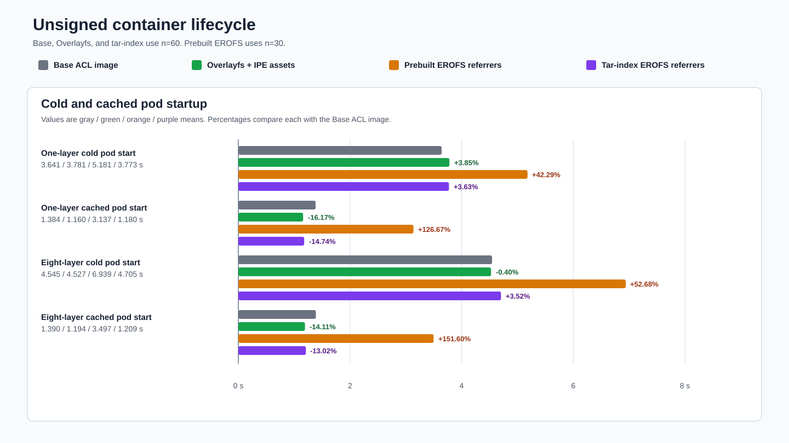
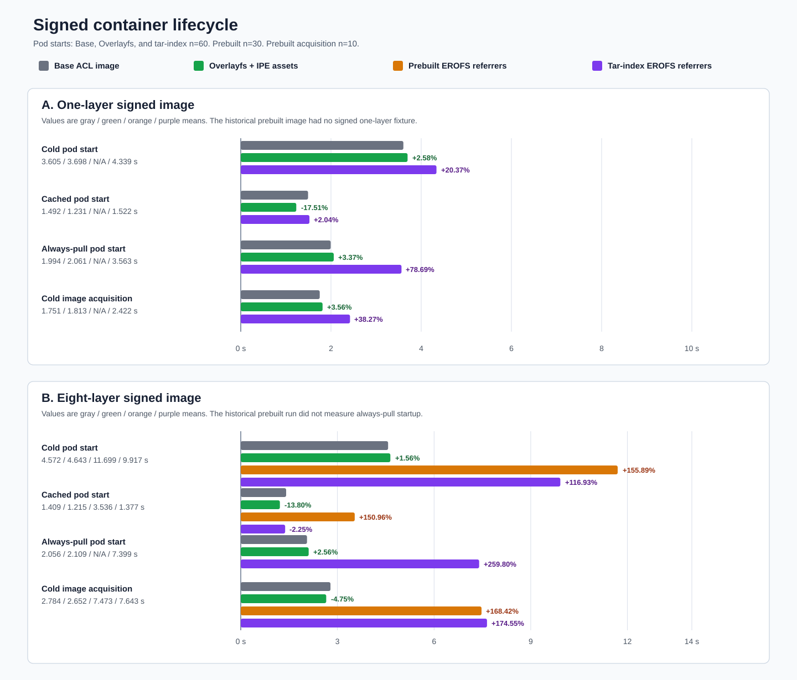
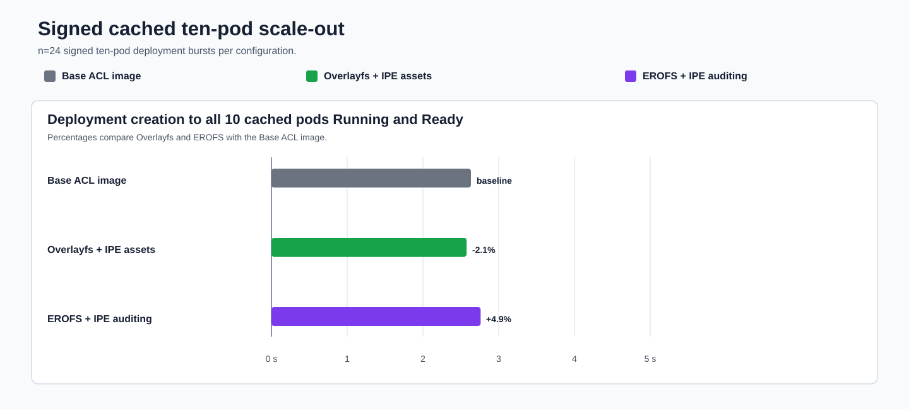
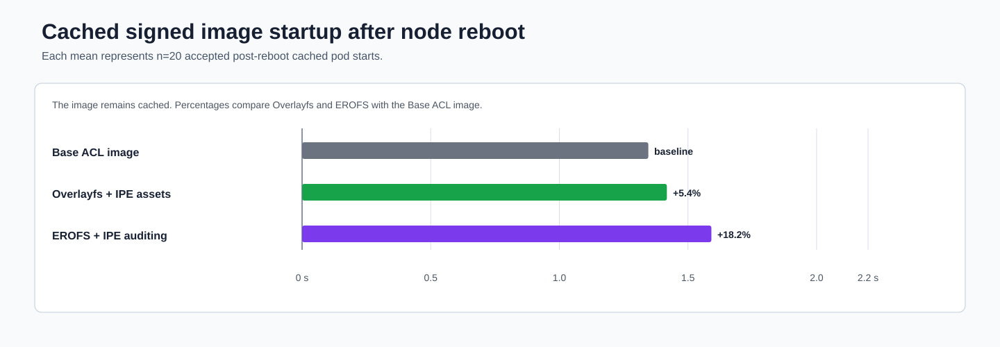

# ACL Container Runtime Performance

**Updated:** 2026-09-14

## Configurations

| Display label | What it means |
|---|---|
| **Base ACL image** | Base ACL image without any modifications |
| **Overlayfs + IPE assets** | Patched containerd and overlayfs with IPE assets present |
| **EROFS + IPE auditing** | Patched containerd using EROFS and dm-verity with permissive IPE auditing set using tags |

Percentages are relative to **Base ACL image** for the same measurement.

## 1. Container lifecycle

| Test | Why it matters |
|---|---|
| **Cold pod start** | Represents the first use of an image on a node. It includes image acquisition, snapshot materialization, container creation, and startup. The snapshotter cache is cleared between each iteration. |
| **Cached pod start** | Represents ordinary restarts and scale-out when the image is already present and `imagePullPolicy: IfNotPresent` can use it locally. |
| **Always-pull pod start** | Represents `imagePullPolicy: Always`, including clusters that apply the `AlwaysPullImages` admission policy. Kubelet checks the image with the container runtime before creating the container even when the image is cached. |
| **Cold image acquisition without pod start** | This is not a normal user operation. Removes the exact image and calls the container runtime image-acquisition API directly. No pod is created and kubelet is not involved. This diagnostic isolates the image-acquisition portion of cold startup. |

### Unsigned Kubernetes startup

Each cell is **mean / p90 / p95** in seconds with `n=60`.

| Configuration | 1-layer cold pod start | 1-layer cached pod start | 8-layer cold pod start | 8-layer cached pod start |
|---|---:|---:|---:|---:|
| Base ACL image | 3.641 / 4.087 / 4.202 | 1.384 / 2.026 / 2.037 | 4.545 / 4.941 / 5.011 | 1.390 / 1.989 / 2.040 |
| Overlayfs + IPE assets | 3.696 / 4.106 / 4.170 | 1.293 / 1.340 / 1.422 | 4.583 / 4.931 / 5.178 | 1.352 / 1.393 / 1.811 |
| EROFS + IPE auditing | 3.773 / 4.193 / 4.305 | 1.180 / 1.850 / 1.915 | 4.705 / 5.293 / 5.547 | 1.209 / 1.525 / 1.995 |

Unsigned EROFS remained within 3.6% of the base image on cold startup and did
not show a cached-start regression.

### Signed Kubernetes startup

Each cell is **mean / p90 / p95** in seconds. Base ACL image and EROFS values
use `n=60`.

| Configuration | 1-layer cold pod start | 1-layer cached pod start | 1-layer always-pull pod start | 8-layer cold pod start | 8-layer cached pod start | 8-layer always-pull pod start |
|---|---:|---:|---:|---:|---:|---:|
| Base ACL image | 3.605 / 4.143 / 4.177 | 1.492 / 1.992 / 2.058 | 1.994 / 2.107 / 2.114 | 4.572 / 4.930 / 5.087 | 1.409 / 1.952 / 1.971 | 2.056 / 2.117 / 2.736 |
| Overlayfs + IPE assets | N/A | N/A | N/A | 4.550 / N/A / N/A | 1.274 / N/A / N/A | N/A |
| EROFS + IPE auditing | 4.339 / 4.702 / 4.921 | 1.522 / 1.583 / 1.640 | 3.563 / 3.696 / 4.265 | 9.917 / 10.890 / 11.121 | 1.377 / 1.527 / 1.554 | 7.399 / 8.236 / 8.342 |

The important split is between cached and registry-facing paths. Signed
eight-layer cached startup remained baseline-like. Cold and always-pull
startup paid for referrer discovery, signature retrieval, and materialization.

### Cold image acquisition diagnostic

This is not a normal user operation. The test calls the container
runtime image-acquisition API directly after removing the exact image. No pod
is created and kubelet is not involved. The test isolates work that also
occurs inside cold and always-pull pod starts.

Each cell is **mean / p90 / p95** in seconds.

| Image | Base ACL image | Overlayfs + IPE assets | Overlayfs mean change versus base | EROFS + IPE auditing | EROFS mean change versus base |
|---|---:|---:|---:|---:|---:|
| 1-layer cold image acquisition | 1.751 / 1.863 / 1.889 | N/A | N/A | 2.422 / 2.660 / 2.724 | **+38.3%** |
| 8-layer cold image acquisition | 2.784 / 2.830 / 2.955 | 2.626 / N/A / N/A | **-5.7%** | 7.643 / 8.394 / 8.473 | **+174.6%** |

## 2. Cached ten-pod scale-out

This test represents a Deployment or DaemonSet burst on a node where the image
is already cached. One observation is the time from Deployment creation until
all ten pods are Running and Ready. It also verifies that ten signed
containers share the expected eight dm-verity mappings.

Each row uses `n=24` signed ten-pod deployment bursts.

| Configuration | Median | p90 | p95 | Median change versus Base ACL image |
|---|---:|---:|---:|---:|
| Base ACL image | 2.633 s | 2.968 s | 3.096 s | **baseline** |
| Overlayfs + IPE assets | 2.576 s | 4.263 s | 4.727 s | **-2.1%** |
| EROFS + IPE auditing | 2.762 s | 3.173 s | 3.347 s | **+4.9%** |

One EROFS cluster had a long first timed burst. Later bursts were
`2.357-3.214 s`, so the median remains the primary comparison.

## 3. Cached image after node reboot

This test represents node maintenance and restart. It verifies that a cached
signed image remains usable without another image pull and that the kernel
dm-verity mappings are recreated when the first cached pod starts.

Each row uses `n=20` accepted cached pod starts after a real node reboot.

| Configuration | Mean | p90 | p95 | Mean change versus Base ACL image |
|---|---:|---:|---:|---:|
| Base ACL image | 1.346 s | 1.705 s | 1.719 s | **baseline** |
| Overlayfs + IPE assets | 1.418 s | 1.759 s | 1.897 s | **+5.4%** |
| EROFS + IPE auditing | 1.591 s | 1.983 s | 2.001 s | **+18.2%** |

Every reboot cleared the eight active container mappings, and the first cached pod recreated all `8/8`.

## 4. General performance

These tests look for broad host or runtime regressions outside image
acquisition and pod startup. Each `kubectl exec` sample starts a fresh
`kubectl` process and runs `/bin/true` in an already-running pod. It includes
the client, API server, konnectivity, and runtime round trip without pod
scheduling. Host-local `/bin/true` isolates local process-launch overhead.
OS-disk I/O checks whether general node storage performance changed.

Each result is **mean / p90 / p95**.

| Measurement | Base ACL image | Overlayfs + IPE assets | Overlayfs mean change versus base | EROFS + IPE auditing | EROFS mean change versus base |
|---|---:|---:|---:|---:|---:|
| `kubectl exec` | 237.835 / 260.8 / 268.5 ms | 254.088 / 273.8 / 276.7 ms | **+6.83%** | 237.960 / 267.3 / 268.0 ms | **+0.05%** |
| Host-local `/bin/true` | 675.542 / N/A / N/A us | 815.748 / N/A / N/A us | **+20.75%** | 600.784 / N/A / N/A us | **-11.07%** |
| Sequential OS-disk read | 19,455.698 / 19,572.404 / 19,572.404 IOPS | 19,388.469 / N/A / N/A IOPS | **-0.35%** | 19,368.207 / 19,394.449 / 19,394.449 IOPS | **-0.45%** |
| Random OS-disk read | 19,549.872 / 19,555.169 / 19,555.169 IOPS | 19,405.832 / N/A / N/A IOPS | **-0.74%** | 19,224.276 / 19,367.024 / 19,367.024 IOPS | **-1.67%** |
| Sequential OS-disk write | 3,548.985 / 3,555.267 / 3,555.267 IOPS | 2,655.162 / N/A / N/A IOPS | **-25.19%** | 3,539.640 / 3,540.012 / 3,540.012 IOPS | **-0.26%** |
| Random OS-disk write | 3,412.007 / 3,553.644 / 3,553.644 IOPS | 3,353.744 / N/A / N/A IOPS | **-1.71%** | 3,517.186 / 3,520.906 / 3,520.906 IOPS | **+3.08%** |

The read and execution results remain closely grouped. EROFS write throughput
also remained within 3.1% of the base image.
